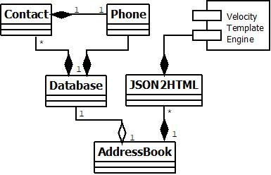

# REST-API-APP-SparkJava
Welcome to the AddressBook - a SparkJava-based REST API application.

## System Context Diagram

The property file, <i>AddressBook.properties</i>, contains a property <i>DEFAULT_DB_XML_FILE</i> pointing to the default database named <i>default-db.xml</i> to be loaded when no external data base(s) is/are specified through <i>-d</i> option. See Section "Execution and testing locally" for command syntax. 

The file <i>endPoints.json</i> records a list of created endpoints that is rendered into HTML form through <i>Apache Velocity</i> template engine. So is <i>releaseNote.json</i> for a list of release note.

## Class Diagram

## Language, Framework, Template and Tool
The REST API application is built upon:
   * _Java v1.8.0_05_, 
   * _SparkJava v2.7.2_ - an open-source web application framework that is embedded with web server _Jetty_, and 
   * _Apache Veolcity_ - a SparkJava-supported template engine to handle message's presentation to fulfill model-view-controller (MVC) design pattern. 

Meanwhile, auto software building tool _Gradle v4.10.2_ has been utilised, with _build.gradle_ as the default configuration file.

## Deployment, Execution and Testing Locally
Once extracted onto a working directory, change into that directory, then execute following command: 
***java -Dserver.port=8001 -jar build/libs/addressbook-all-1.6.1.jar*** 
Where more options are available 
-h to print help message. 
-d for XML-based database files to load. If omitted, _~/db/default-db.xml_ inside the jar file would be loaded by default. 

As of this writing, the application's version is 1.6.1.

Then through a web browser, open following URL for testing: 
[http://localhost:8001/addressbook](http://localhost:8001/addressbook)

## Hosting remotely
The application is currently being hosted by www.heroku.com with following URL 
[rest-api-app-sparkjava.herokuapp.com/addressbook](https://rest-api-app-sparkjava.herokuapp.com/addressbook)

### Deployment to Heroku
Unlike locally deployment, there are more details to emphasise to the remote server.  
File _Procfile_, whose content is shown below, serves a critial purpose on how deployment should be treated by server _Heroku_.
___web: java $JAVA_OPTS -Dserver.port=$PORT -jar build/libs/addressbook-all-1.6.1.jar___

The _Procfile_'s content critically tells _Heroku_ server that
   * the deployment is a web application,
   * to execute the application through the specified jar file, and
   * the port numner is to be assigned by the server through property _server.port_.
