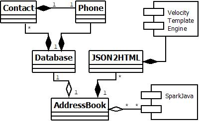

# REST-API-APP-SparkJava
Welcome to the AddressBook - a SparkJava-based REST API application.

## System context diagram

## Class diagram

## Language, framework, template and tool
The application is built upon:
   * _Java v1.8.0_05_, 
   * REST API framework _SparkJava v2.7.2_ and 
   * _Veolcity Template_ which is supported by SparkJava.

Meanwhile, auto software building tool _Gradle v4.10.2_ has been utilised.

## Execution and testing locally
Once extracted onto a working directory, change into that directory, then execute following command:
__ java -Dserver.port=8001 -jar build/libs/addressbook-all-1.5.1.jar__
Where the options are
-h to print help message
-d for XML-based database files to load. By default, _~/db/default-db.xml_ will be loaded.

Then through a web browser, open following URL for testing:
[localhost:8001/addressbook](http://localhost:8001/addressbook)

## Hosting
The application is currently being hosted by www.heroku.com with following URL
[rest-api-app-sparkjava](https://rest-api-app-sparkjava.herokuapp.com/addressbook)
